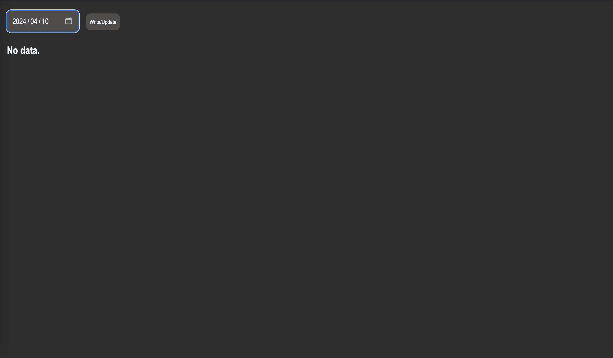
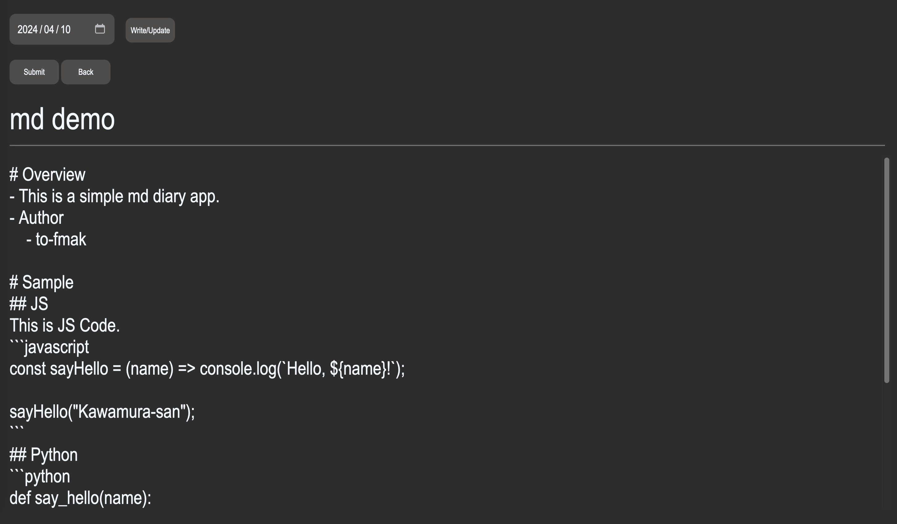
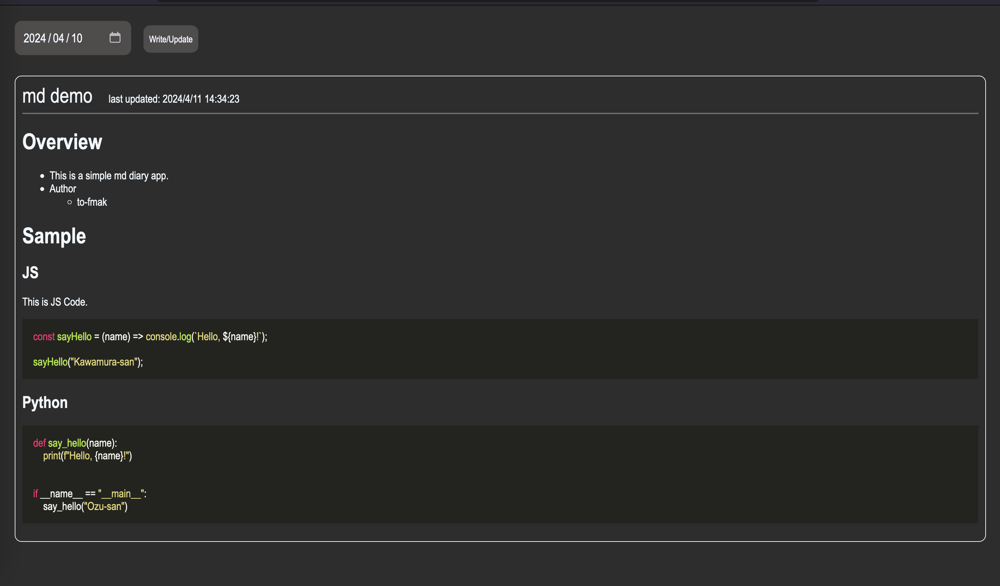
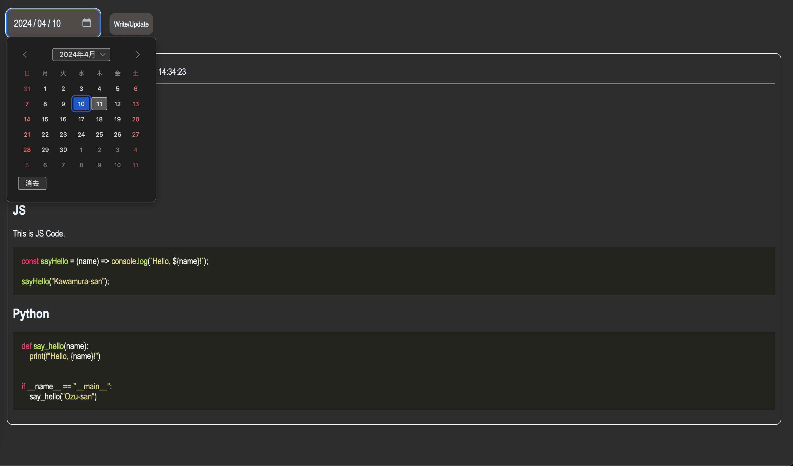

# Introduction
- A simple markdown diary app





# Docker Version
- docker >= 20.10.23
- docker-compose >= 2.15.1

# Usage
1. Set environment variables for MongoDB username and password (set any username and password).
```bash
export DB_USERNAME=root
export DB_PASSWORD=pass
```

2. Generate a Docker image for the app using the `docker build` command.
```bash
docker build -t diary-app .
```

3. Start Docker containers for the app, the database, and the web-based database console using `docker-compose` command.
```bash
docker-compose up -d
```

4. Open the app in a browser using the following URL.
```
http://localhost:8080
```

# Data Storage Path
- Data is stored in `./mongodb_data/`, and database settings are stored in `./configdb/`. You can modify the related volumes settings in the `docker-compose.yml` file to change these paths.
